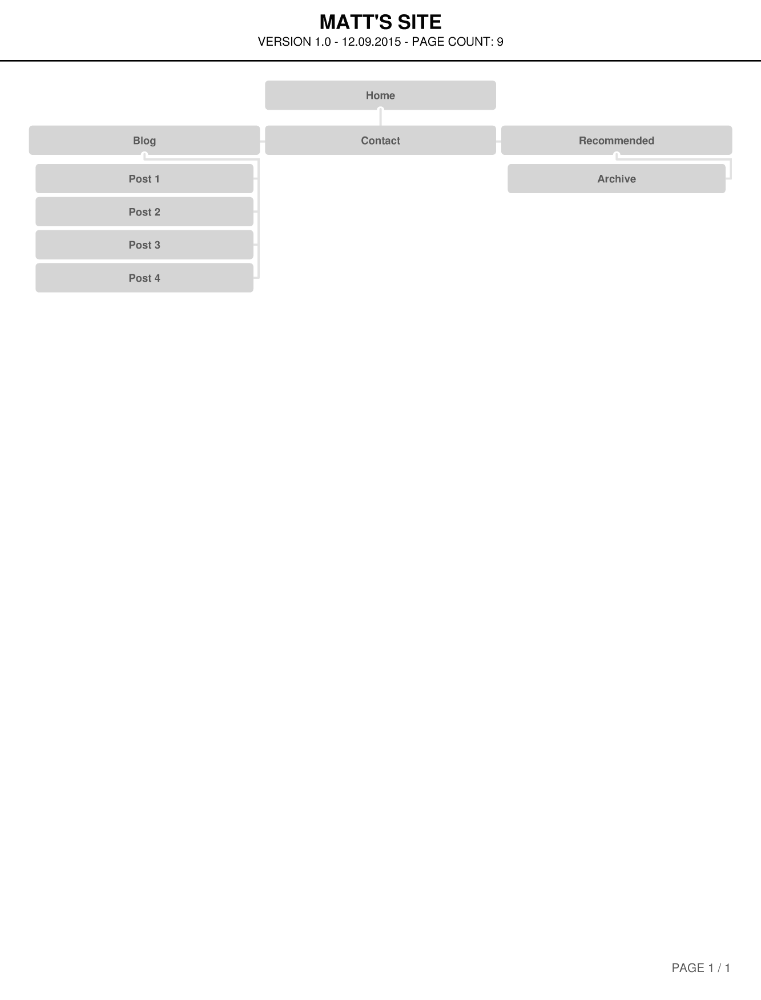

What are the 6 Phases of Web Design?
-Info gathering, planning, design, development, test/delivery, maintenence

What is your site's primary goal or purpose? What kind of content will your site feature?
-The primary goal is to express myself and my knowledge relating to tech in a clear, professional way. The content will be primarily blog posts about tech and DBC, with some additional links to my social media sites.

What is your target audience's interests and how do you see your site addressing them?
-The target audience are employers, so I think their interest would be seeing a person who has practical knowledge relating to technology, is able to communicate in a clear and concise way, and has a generally positive demeanor in which they present that info, while being excited about their field.

What is the primary "action" the user should take when coming to your site? Do you want them to search for information, contact you, or see your portfolio? It's ok to have several actions at once, or different actions for different kinds of visitors.
-The primary actions would be to have access to blog posts and be able to read those easily. After that, easy access to contact info and social media is crucial.

What are the main things someone should know about design and user experience?
- It is important that you take it step by step and plan out small details as you go. It seems very easy to rush through website design and then end up with a lot of difficult to solve errors. I would focus a lot on early planning as it relates to user experience. In the early stages you should consider the audience and how they could easily navigate to the important info on the website. Once you know the content that is most important to delivery to the audience, you just need to keep things simple and then do what you think is aesthetically pleasing.

What is user experience design and why is it valuable?
-User experience design is designing a website based on scientifically studied users' experience of the website. There are many ways to do this, for example having two different versions of the same site, and seeing if different design choices(like the color of a button) affect the number of times that users click it. This data is valuable because it really does put the top priority on the user friendliness of the website, thus creating the most user efficient site.

Which parts of the challenge did you find tedious?
- I don't think I found anything about this challenge particularly tedious, but I did have difficulty understanding and implementing the explanation for markdown syntax.
