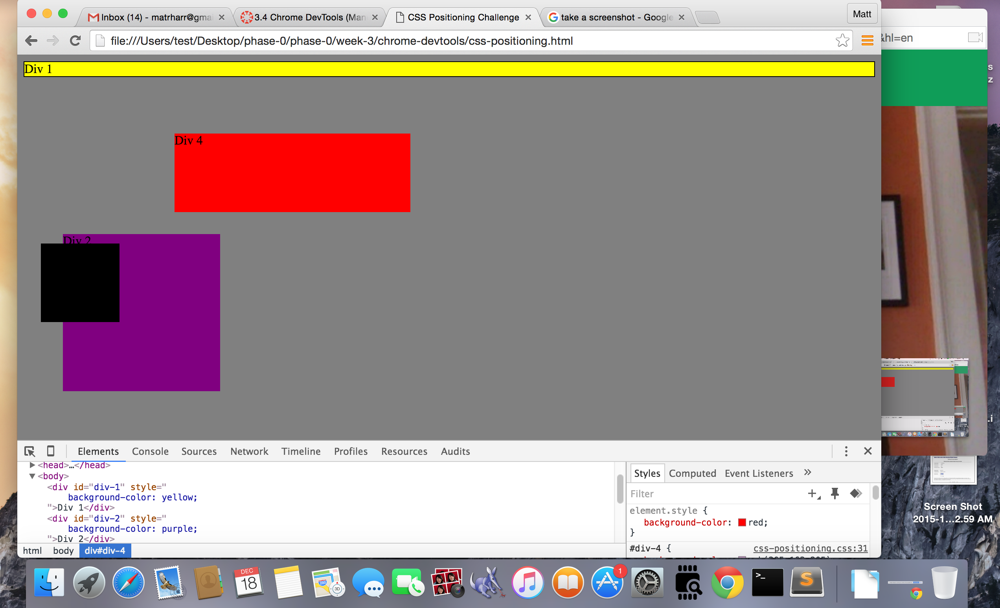
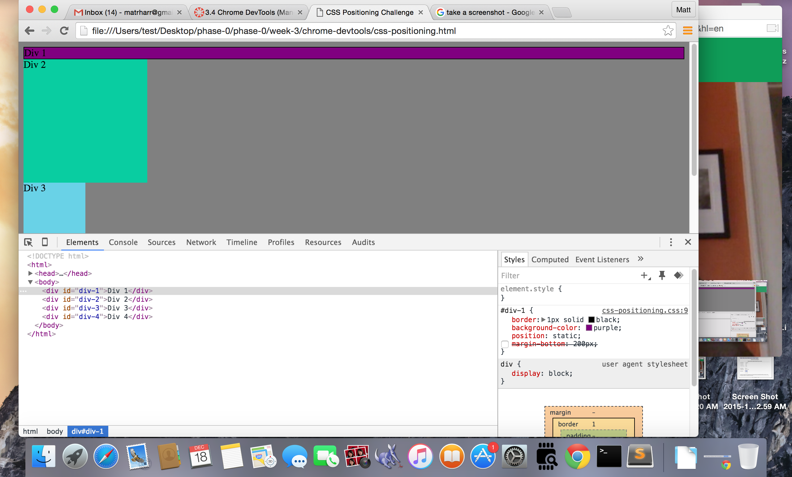
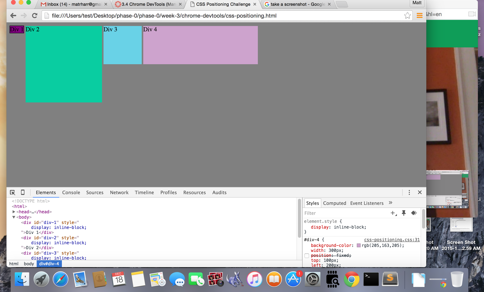
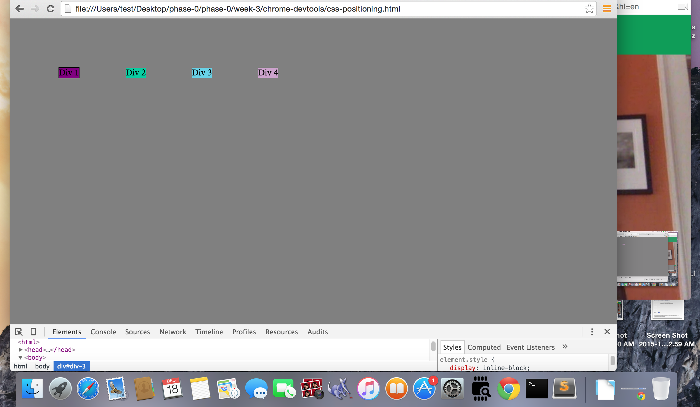
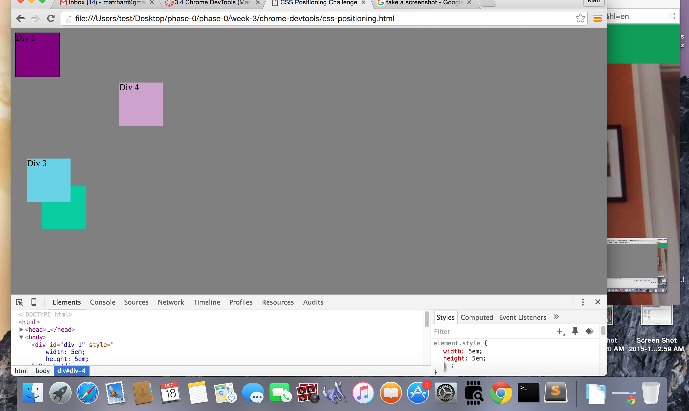
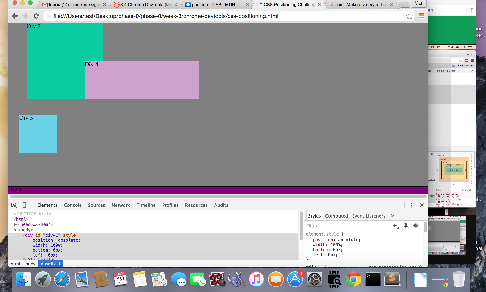
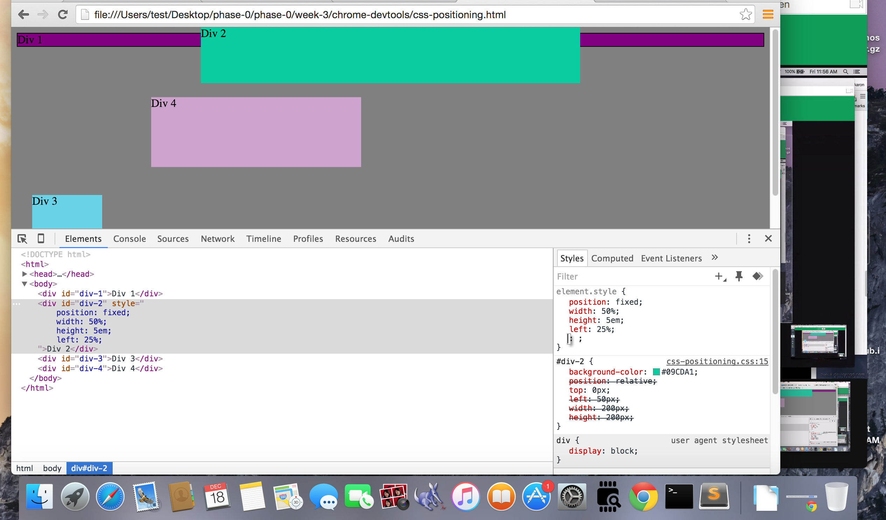
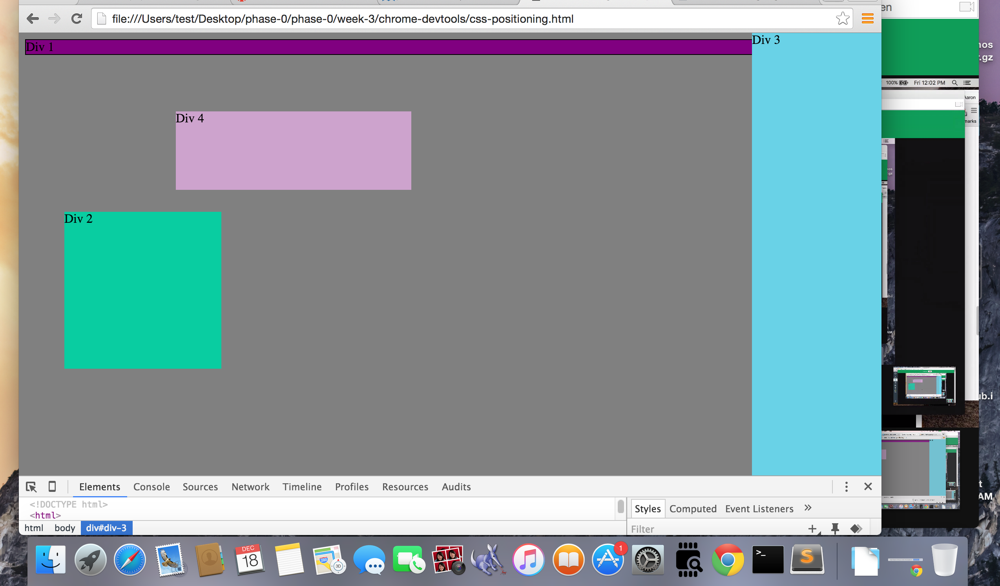
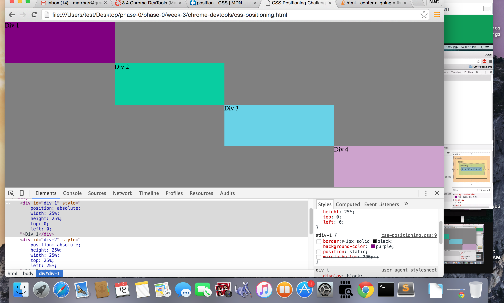

<!-- How can you use Chrome's Devtools inspector to help you format or position elements?
  - It works pretty well because you can navigate quickly and manipulate properties and elements easily and change back easily. The set up is nice because you can get feedback instantly, rather than switching from a text editor to a browser.

How can you resize elements on the DOM using CSS?
  - You can resize elements by adding properties or by changing the values in a little display of the selected element.

What are the differences between absolute, fixed, static, and relative positioning? Which did you find easiest to use? Which was most difficult?
  -static is the default position for all elements and works the same as a bunch of stacked blocks on top of each other in a vertical row. relative is the same, but responds when giving values to top/left/bottom/right. fixed stays in the browser window while it scrolls, and absolute can be placed anywhere independent of other elements. I think relative and absolute might be easiest, but I still need to learn more of the nuances to really know which to use in a certain situation. I found that static elements could be difficult to manipulate, because other elements would move around with them.

What are the differences between margin, border, and padding?
- margin is the space between elements, border is the space that surrounds the element, and padding is the space between the border and the element.
What was your impression of this challenge overall? (love, hate, and why?)
- at first I found it very frustrating because I didn't have a good grasp of css in general. working with a pair on it was great, and I think we both learned a good bit. I feel like using devtools helped me gain a better perspective of css and it does seem a little more straightforward. I plan on using devtools in the future.

-->