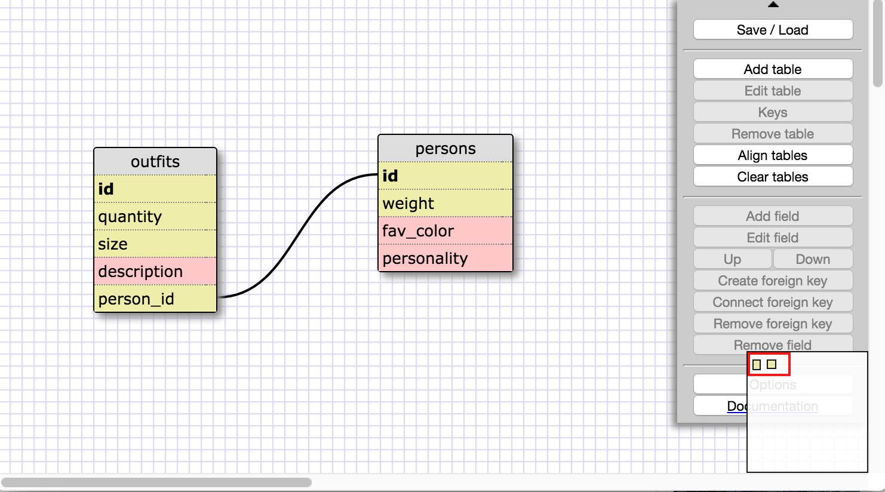

1. SELECT * FROM states;

2. SELECT * FROM regions;

3. SELECT state_name, population FROM states;

4. SELECT state_name, population FROM states ORDER BY population DESC;

5. SELECT state_name FROM states WHERE region_id = 7;

6. SELECT state_name, population_density FROM states
   WHERE population_density > 50 
   ORDER BY population_density ASC;

7. SELECT state_name FROM states 
   WHERE population BETWEEN 1000000 AND 1500000;

8. SELECT state_name, region_id FROM states ORDER BY region_id ASC;

9. SELECT region_name FROM regions 
   WHERE region_name
   LIKE '%central';

10. SELECT
    regions.region_name, states.state_name
    FROM
    regions
    JOIN states ON
    regions.id = states.region_id
    ORDER BY region_id ASC;

Reflection
-What are databases for?
-Databases can store large amounts of information. The information can be sorted into rows/columns and accessed according to those values. You can compare data across different tables and perform calculations.
-What is a one-to-many relationship?
-A one to many relationship is where there is a single value, like an id number, which is repeated over and over because more than one item has that id. In this challenge, the region id was shared by many states.
-What is a primary key? What is a foreign key? How can you determine which is which?
-A primary key is a unique key in a table, it cannot accept null values and you can only have one. A foreign key accepts null values, is a key that is a primary key in a different table and you can have many foreign keys in a table.
-How can you select information out of a SQL database? What are some general guidelines for that?
-You really just have to know the keywords and their order, basically the same concept as with any other programming language. SQL is especially straightforward because the order plays out similar to an english sentence. So far, I've always begun with SELECT column FROM table, and then you can do WHERE and a condition, then ORDER BY column.
