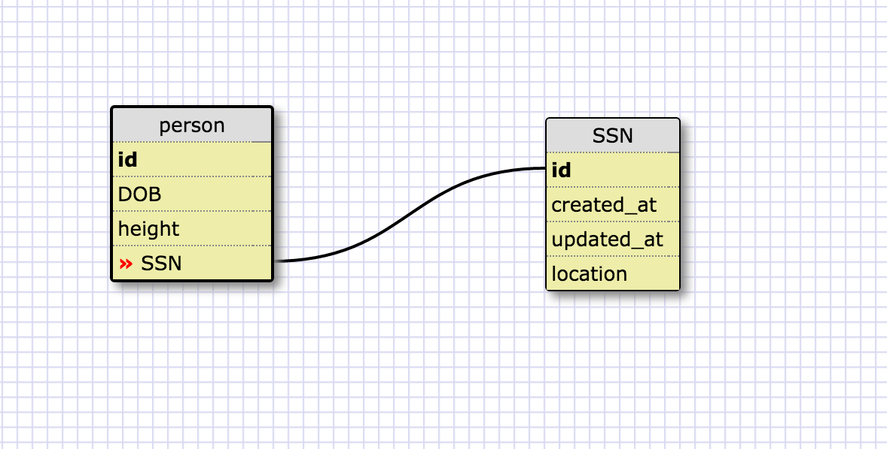
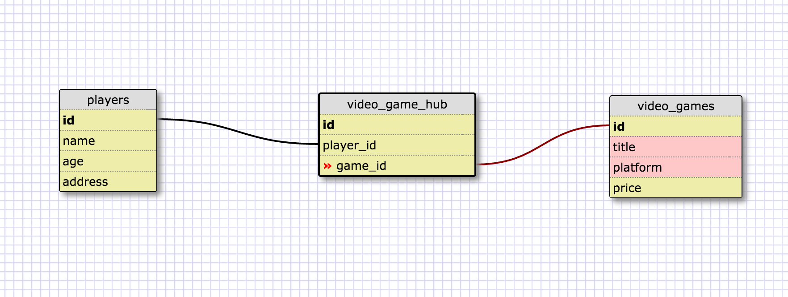
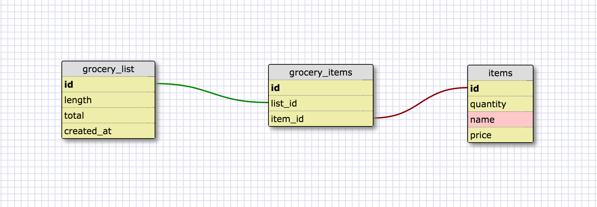

Release 2: One to one schema

Release 3: Many to Many relationships

Release 4: Refactor

Release 6: Reflection
What is a one-to-one database?
One to one means that each item is a member of a pair. They cannot have multiple relationships with other like items, and in a one to one relationship, both items are connected to each other in this way.

When would you use a one-to-one database? (Think generally, not in terms of the example you created). Person and fingerprint. Each person has a unique fingerprint and every fingerprint belongs to one person.

What is a many-to-many database?
Many to many means that each item in a pair is not necessarily linked only to a particular instance of another item, rather each item in any pair can have a relationship to a number of other instances of the item.

When would you use a many-to-many database? (Think generally, not in terms of the example you created).
Artist and genre. An artist may work in a variety of different genres and in turn, a genre has many different artists.

What is confusing about database schemas? What makes sense?
It is little confusing to determine what relationships certain values have, and to pick which values can connect. Overall, the concepts make total sense, I think for me it is just about getting more experience querying data, performing calculations, and joining tables.
